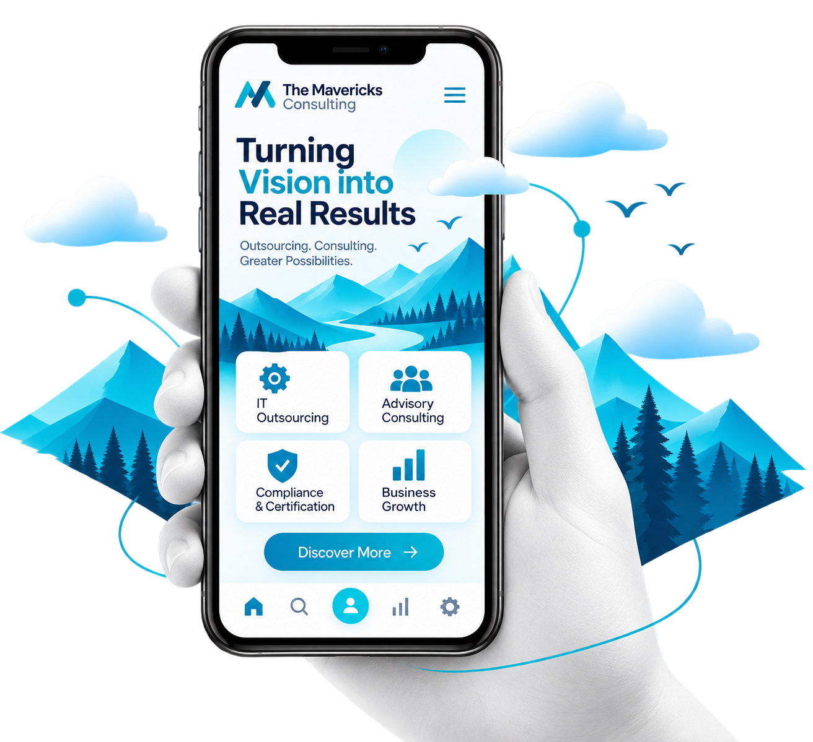

# The Mavericks Consulting — Web Application

A modern, responsive web application replica and digital experience for **The Mavericks Consulting**, built with React 18, Vite, and Tailwind CSS.



---

## 🌟 Key Features

- **Dynamic Navbar**: Logo branding, staggered item entrance, glowing ambient light sweep, animated dropdowns, and responsive mobile navigation drawer.
- **Hero Section**: Word-by-word headline reveal, value proposition, and silky smooth floating 3D consulting mockup graphic.
- **Who We Are**: Full-width primary teal (`#00A8CC`) brand banner with high-contrast typography.
- **Why The Mavericks Consulting**: Clean white layout with large display heading, dividing line, and 4-metric statistics counter.
- **Our Services (Pinned Staircase Canvas)**: Dot-grid canvas with 4 pinned process milestone cards in a descending zigzag arrangement with entrance animations and interactive modals.
- **Dedicated Service Page — Compliance Certifications**:
  - Full-page showcase for **SOC 2**, **PCI DSS**, **GDPR**, **VAPT**, and **ERC**.
  - Official high-res certification illustrations.
  - Interactive *[Learn More]* scope and deliverables modals.
- **Testimonials Quote Cards**:
  - Custom speech-bubble card with oversized quote marks and classic bubble tail.
  - 40–50% overlapping circular headshot photo and dark navy name chip.
  - Interactive bottom thumbnail selector strip to switch client reviews on click.
- **Consultation Form & CTA Banner**: Interactive form validation and simulated submission feedback.
- **Footer**: Full-width cyan footer with scroll-triggered entrance animations and newsletter signup.

---

## 🛠️ Tech Stack

- **Framework**: [React 18](https://react.dev/)
- **Build Tool**: [Vite 6](https://vitejs.dev/)
- **Styling**: [Tailwind CSS v3](https://tailwindcss.com/)
- **Icons**: [Lucide React](https://lucide.dev/)
- **Typography**: Plus Jakarta Sans

---

## 🚀 Getting Started

### 1. Clone the repository
```bash
git clone https://github.com/<YOUR-USERNAME>/<YOUR-REPO-NAME>.git
cd <YOUR-REPO-NAME>
```

### 2. Install dependencies
```bash
npm install
```

### 3. Start the development server
```bash
npm run dev
```
Open [http://localhost:5173](http://localhost:5173) in your browser.

### 4. Build for production
```bash
npm run build
```
The optimized bundle will be generated in the `dist/` directory.

---

## 📁 Project Structure

```
├── public/
│   ├── logo.png
│   └── maverick-hero.png
├── src/
│   ├── components/
│   │   ├── ComplianceCertifications.jsx # Dedicated certifications page
│   │   ├── ConsultationForm.jsx         # Free consultation form
│   │   ├── CtaBanner.jsx                # Action callout banner
│   │   ├── Footer.jsx                   # Animated footer
│   │   ├── Hero.jsx                     # Hero section with animated graphic
│   │   ├── Navbar.jsx                   # Responsive header & navigation
│   │   ├── Services.jsx                 # Pinned staircase services canvas
│   │   ├── Testimonials.jsx             # Speech-bubble quote cards & selector
│   │   ├── WhoWeAre.jsx                 # Full-width brand introduction
│   │   └── WhyUs.jsx                    # Why Mavericks & stats counter
│   ├── App.jsx                          # Root component with routing
│   ├── index.css                        # Design system & custom keyframes
│   └── main.jsx                         # React DOM entry point
├── index.html
├── package.json
├── tailwind.config.js
└── vite.config.js
```

---

## 📄 License

MIT © [The Mavericks Consulting](https://themavericksco.com)
